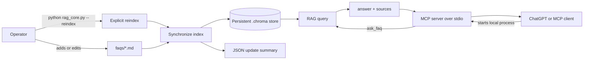
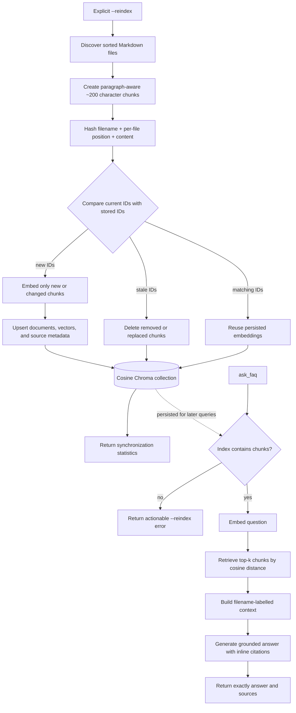

# FAQ RAG + MCP Tool

A minimal retrieval-augmented generation service that indexes Markdown FAQs in
an embedded Chroma database and exposes them through one MCP tool.

## Design

- FAQ text is split into paragraph-aware chunks of approximately 200 characters.
- OpenAI creates embeddings for new or changed chunks.
- Embedded Chroma persists the index locally and performs cosine retrieval.
- Stable chunk IDs prevent duplicate records and unnecessary re-embedding.
- Explicit reindexing adds changed chunks and deletes stale chunks.
- The LLM answers only from retrieved context and cites source filenames inline.
- FastMCP exposes the service over stdio; no separate Chroma server is required.

The local Chroma store is intentionally lightweight for this exercise. A larger
deployment could use Chroma's client/server mode or another managed vector store
without changing the MCP tool contract.

## Operating workflow



Run `--reindex` initially and whenever source files change. Query requests read
the existing index directly, avoiding a filesystem scan and synchronization on
the interactive path. The MCP client starts and communicates with the server
over stdio; Chroma runs inside that local Python process and does not require a
separate service.

## Internal flow



Changing `EMBED_MODEL` or `CHUNK_SIZE` recreates the collection so incompatible
vectors cannot be mixed. Normal source changes remain incremental: unchanged
chunks are reused, new content is embedded, and stale content is removed when
`--reindex` runs.

## Setup

```bash
python3 -m venv .venv
source .venv/bin/activate
pip install -r requirements.txt
export OPENAI_API_KEY=sk-...
```

Optional configuration:

```bash
export FAQ_DIR=/absolute/path/to/faqs
export CHROMA_PATH=/absolute/path/to/.chroma
export CHROMA_COLLECTION=faq_chunks
export EMBED_MODEL=text-embedding-3-small
export LLM_MODEL=gpt-4o-mini
export CHUNK_SIZE=200
export TOP_K_DEFAULT=4
```

Changing the embedding model or chunk size recreates the collection to prevent
mixing incompatible vectors. Run `python rag_core.py --reindex` after changing
the configuration or editing, adding, deleting, or renaming an FAQ.

## Run

CLI smoke test:

```bash
python rag_core.py
```

Explicitly synchronize the FAQ directory without asking a question:

```bash
python rag_core.py --reindex
```

The command prints a JSON summary:

```json
{
  "source_files": 3,
  "chunks_total": 7,
  "chunks_added": 0,
  "chunks_deleted": 0,
  "chunks_unchanged": 7
}
```

Only new or changed chunks call the embedding API. Deleted and renamed source
files remove their stale records from Chroma.

MCP server:

```bash
python mcp_server.py
```

Example MCP client configuration:

```json
{
  "mcpServers": {
    "faq-rag": {
      "command": "/absolute/path/to/ragmcp/.venv/bin/python",
      "args": ["/absolute/path/to/ragmcp/mcp_server.py"],
      "env": {
        "OPENAI_API_KEY": "sk-..."
      }
    }
  }
}
```

The server reserves stdout for MCP's stdio protocol.

## Tool contract

`ask_faq` accepts:

- `question`: required, non-empty string
- `top_k`: optional integer from 1 through 10; default 4

It returns exactly:

```json
{
  "answer": "Grounded answer with inline [filename.md] citations.",
  "sources": ["filename.md"]
}
```

At least two distinct filenames are cited when the retrieved evidence makes two
sources available. A source is never fabricated merely to reach two citations.

## Tests

The unit tests use fakes and do not call OpenAI:

```bash
OPENAI_API_KEY=test python -m unittest -v
```

For an end-to-end demo, ask:

1. `How do I reset my password?`
2. `How do I enable SSO?`
3. `What should an employee know about PTO and equity?`

Run `python rag_core.py --reindex` before the first request. Later requests read
the persisted `.chroma/` index without rescanning the FAQ directory.
